| Image | Image | Image |
|-------|-------|-------|
|  |  |  |
|  |  |  |
|  |  |  |
|  |  |  |
|  |  | 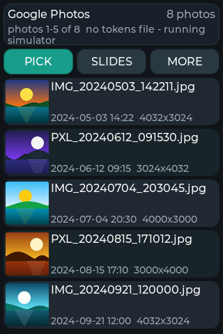 |
| 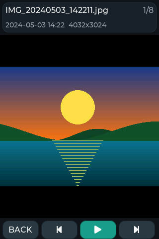 | 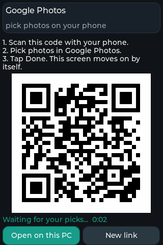 | 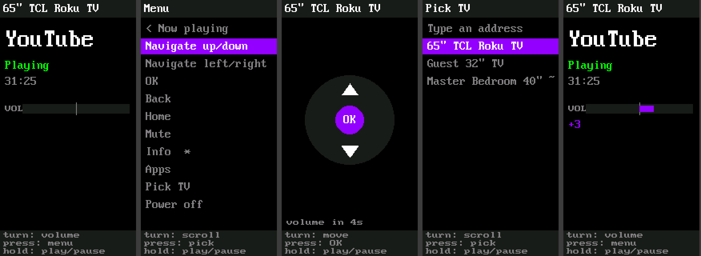 |
| 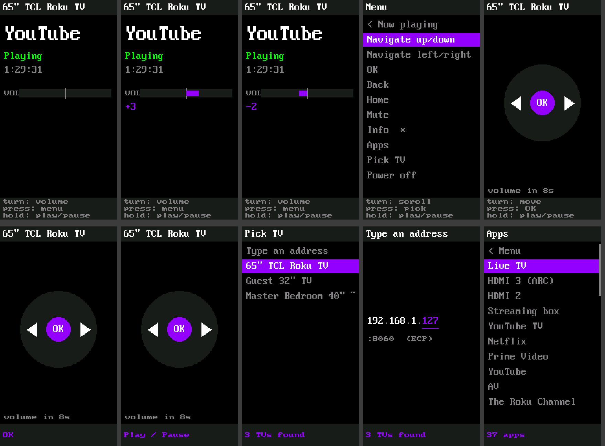 |  |  |

On Android (the PyDevices Runner) and as an installed PWA:

| Image | Image | Image |
|-------|-------|-------|
| 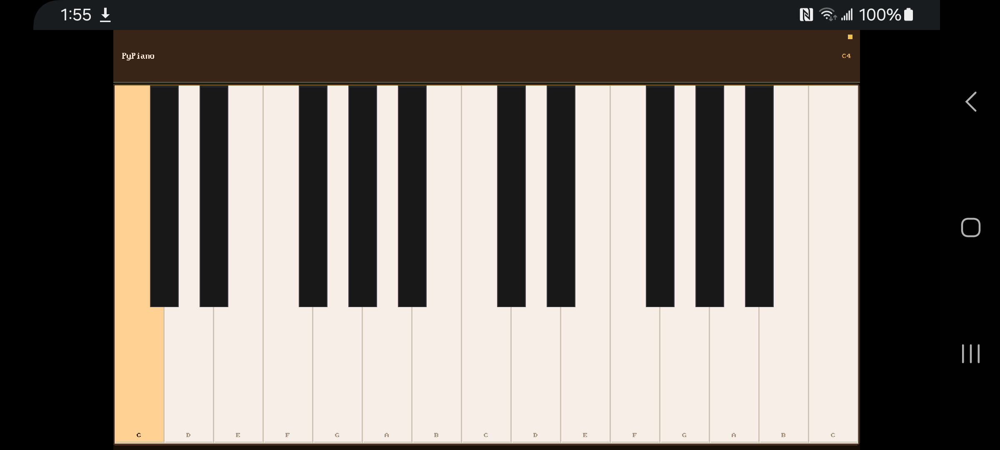 | 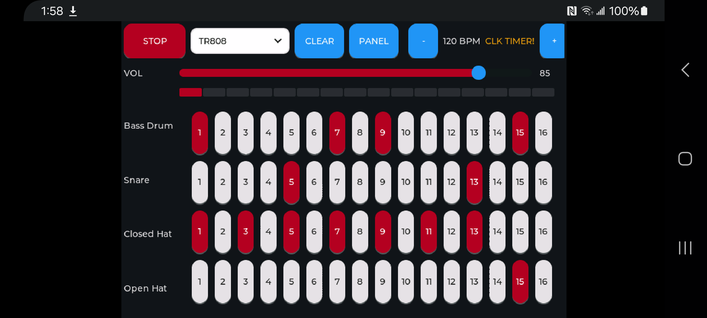 | 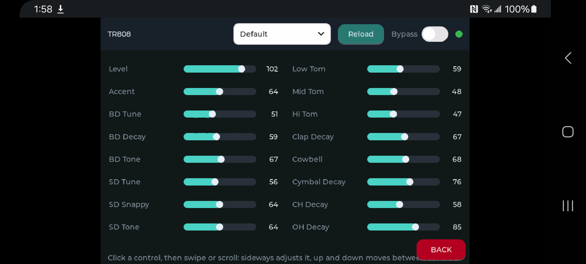 |
| 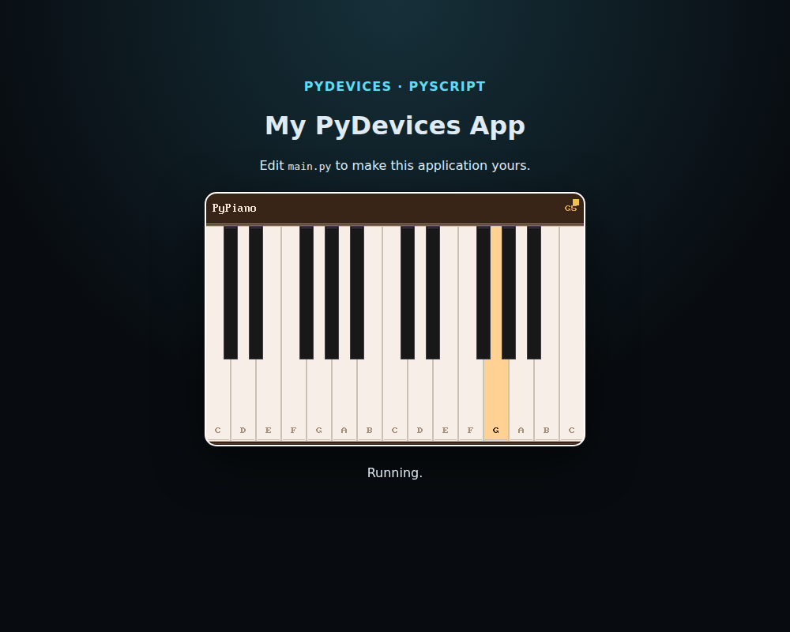 | 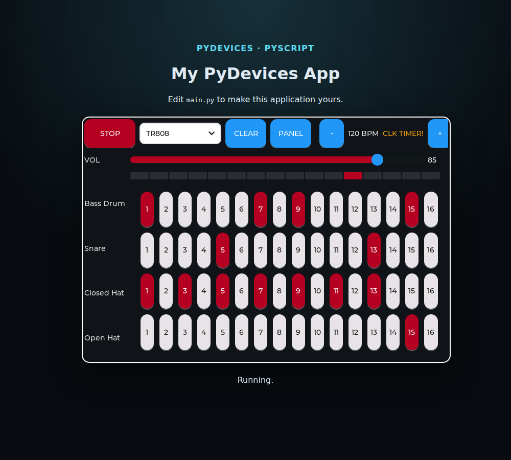 | 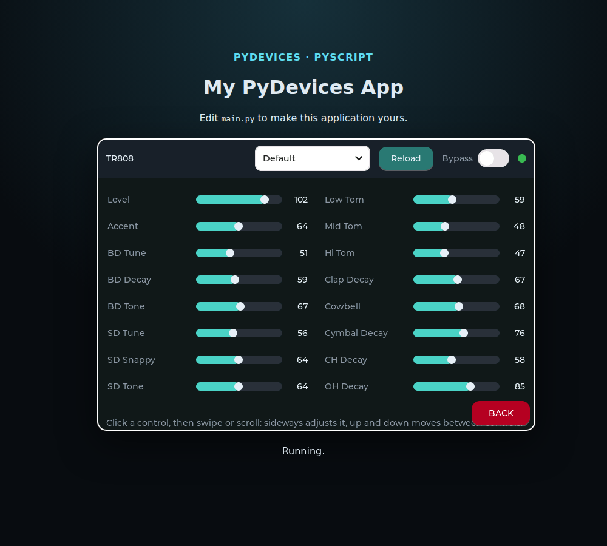 |
| 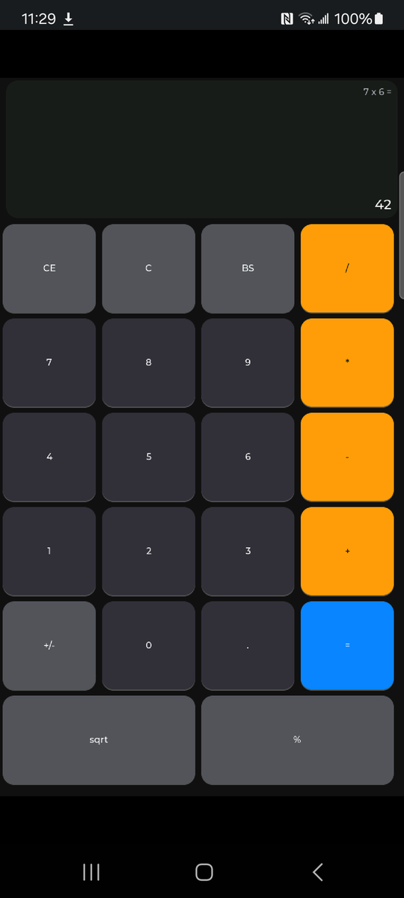 | 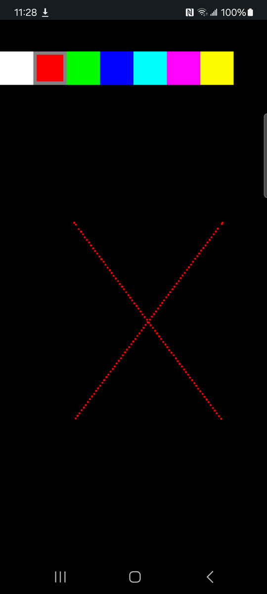 |  |
