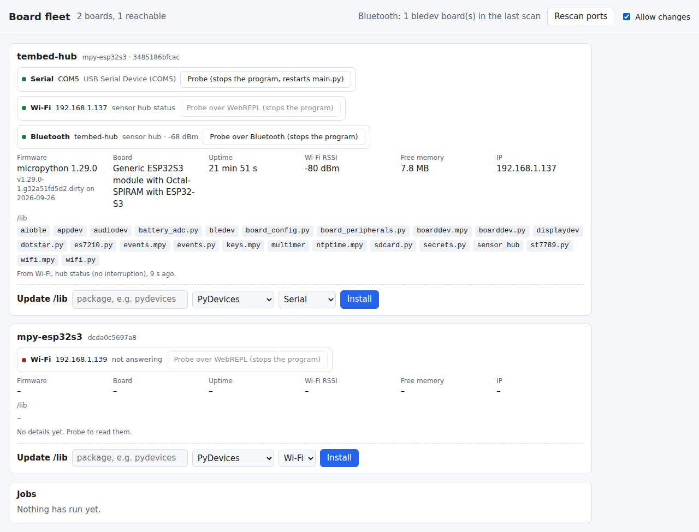

# Fleet page

One page on your PC that lists every board mpftp can reach, over serial,
Wi-Fi or Bluetooth: its firmware, uptime, Wi-Fi signal, free memory and
what's in `/lib`. You can install a released package into a board's `/lib`
from it, one click and one confirmation at a time.



```bash
python lib/examples/fleet_page/fleet.py --ble
# open http://localhost:8700
```

It needs Python 3.9 or later and mpftp, and nothing else. If `mpftp` isn't
on your PATH, pass `--mpftp PATH` or set `MPFTP`. `--ble` needs bleak in
the Python that owns the radio (on WSL, the Windows one).

## It won't stop your programs

Every mpftp connection to a board's REPL, over serial or WebREPL, interrupts
whatever the board is running. So the page never does that by itself:

- **Serial boards** come from the list of ports, which doesn't touch the
  boards. Their details are read only when you click Probe. Probe stops the
  program, reads the details, then soft-reboots the board so `main.py` runs
  again.
- **Wi-Fi boards** (the ones mpftp remembers, plus any `--host`) are asked
  for `/api/status` every 15 seconds. A board running the
  [sensor hub](../sensor_hub/README.md) answers it without stopping anything.
  Any other board shows as reachable or not, and gives its details on a
  WebREPL probe you click.
- **Bluetooth boards** come from a passive scan every minute for bledev's
  services: its REPL, file transfer, or the sensor hub. The scan doesn't
  connect to anything.

The page shows one board once, with every route it was seen on. It matches
a serial port to a Wi-Fi board by the chip's ID, and a Bluetooth name to the
hub that reported it.

## Changing a board

The page is read-only until you tick **Allow changes**. Each board then gets
an **Update /lib** row. Name a package from the PyDevices index or
micropython-lib, pick the route, and press Install. It asks you to confirm,
runs `mpftp mip` and restarts `main.py`, and the result goes in the Jobs
list. Start the server with `--read-only` to take the option away entirely.
`--skip COM4 --skip 192.168.1.147` leaves a board alone completely, such as
one another program is using.

## Check it

`check_fleet.py` runs against a board that hosts the sensor hub. It passes
when the page lists the board by serial and Wi-Fi with all its details, keeps
refreshing them, and the hub's own uptime grows through the whole wait, so
nothing interrupted it.

```bash
python lib/examples/fleet_page/check_fleet.py --board 192.168.1.137
python lib/examples/fleet_page/check_fleet.py --board 192.168.1.137 --plant-probe   # must fail
```

`--plant-probe` asks the page for a serial probe halfway through, which
restarts the hub, and the check catches it.
