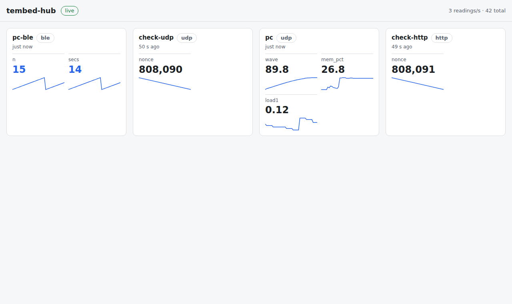

# Sensor hub

A board collects readings from other devices and serves a live dashboard
you can open on a phone or a PC. Nodes send it numbers over Wi-Fi (UDP or
HTTP) or Bluetooth, and every browser watching sees them the moment they
arrive, with a sparkline of the last 40 values.



It runs on the T-Embed today and needs nothing board-specific, so the P4 can
take over as the hub later.

## Run it on a board

The board needs MicroPython with Wi-Fi, a `secrets.py` and pydevices'
`wifi.py` in `/lib` ([board bring-up](https://github.com/PyDevices/pydevices/blob/main/docs/board-bringup.md)),
and for the Bluetooth door, `bledev` and `aioble` (`mpftp mip -d COM5 aioble`).

```bash
mpftp mkdir -d COM5 /lib/sensor_hub
for f in __init__.py hub.py wsfeed.py blefeed.py dashboard.html publish.py; do
  mpftp put -d COM5 lib/examples/sensor_hub/$f /lib/sensor_hub/$f
done
mpftp put -d COM5 lib/examples/sensor_hub/board_main.py /main.py
mpftp hard-reset -d COM5
```

Then open `http://<board's IP>/` on anything on the same network. Name the
hub in `board_main.py`. Its Bluetooth name can be 8 characters at most, which
is all that fits in the advertisement beside the service UUID; a longer one
shows up in Chrome's chooser as "Unknown or Unsupported Device".

## Send it readings

From a PC, `publish.py` sends the machine's load, memory in use and a slow
wave once a second:

```bash
python lib/examples/sensor_hub/publish.py 192.168.1.137               # UDP
python lib/examples/sensor_hub/publish.py 192.168.1.137 --via http
```

From your own code, on a PC or a board, it's one call:

```python
from sensor_hub.publish import send
send("192.168.1.137", "greenhouse", {"temp": 21.4, "rh": 55})
```

Or skip the helper. A reading is one UDP datagram to port 5005, or the body
of a `POST /api/publish`, in either of these forms:

```text
{"node": "greenhouse", "readings": {"temp": 21.4, "rh": 55}}
greenhouse temp=21.4 rh=55
```

**Over Bluetooth**, write the same text to the hub's characteristic
(service `7d9a0001-5a5e-4c2b-9f0e-8b3c1d2e4f60`, characteristic
`7d9a0002-…`). Two ready-made publishers:

- `ble_publish.py` on a PC, through `bledev`. On WSL, run it with the Windows
  Python, which owns the radio, with pydevices' `lib` on its `PYTHONPATH`.
- `ble_publish.html` on a phone, through Web Bluetooth in Chrome. It sends
  the phone's battery level, its tilt and a slider. Web Bluetooth needs
  `https://` or `localhost`, so serve this folder from the PC and forward it:
  `python -m http.server 8765`, `adb reverse tcp:8765 tcp:8765`, then open
  `http://localhost:8765/ble_publish.html` on the phone and tap Connect.

The hub serves one Bluetooth central at a time, and stops advertising while
one is connected.

## What the hub serves

| Path | What |
|---|---|
| `/` | the dashboard (`?hub=HOST` points it at another hub) |
| `/ws` | the WebSocket feed: a snapshot first, then one message per reading |
| `/api/readings` | the same snapshot, as JSON |
| `/api/status` | firmware, uptime, RSSI, free memory and `/lib`, without interrupting anything. The [fleet page](../fleet_page/README.md) reads it |
| `POST /api/publish` | one reading |

## Check it

`check_hub.py` opens the feed, publishes a fresh random number over UDP and
another over HTTP, and passes only when both come back on the feed
unchanged. `--expect-node NAME` also waits for a node such as a Bluetooth
publisher.

```bash
python lib/examples/sensor_hub/check_hub.py 192.168.1.137 --expect-node pc-ble --timeout 40
```

To see it fail, start a hub whose feed drops everything:
`micropython -m examples.sensor_hub --port 8099 --no-ble --plant drop_feed`
from `lib`, then check `127.0.0.1 --port 8099`.

On the T-Embed, which sits at -80 to -84 dBm from the router, a reading
reached the browser feed in 0.1 to 3.5 s over a dozen runs, and a plain
status request took 0.3 to 2.2 s. Two runs in a row found the board briefly
unreachable. That's what a weak signal looks like; put a hub closer to the
router before blaming the code.
