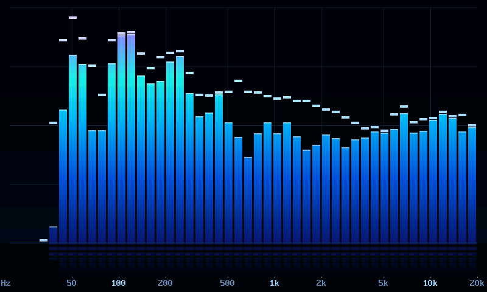
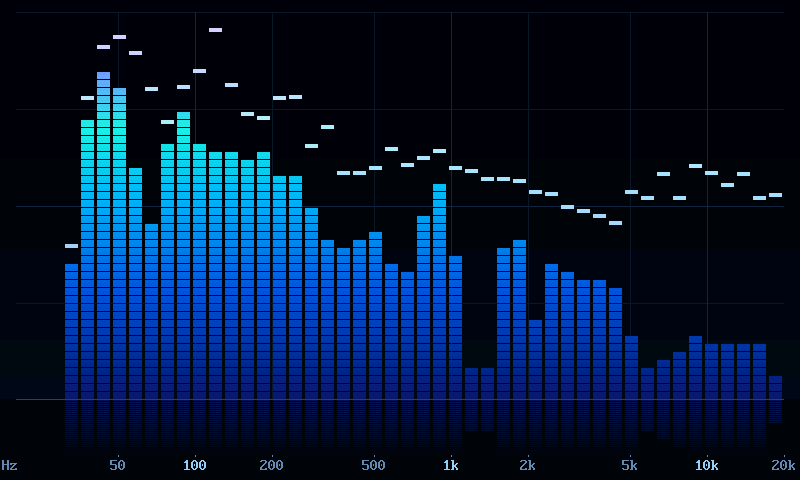
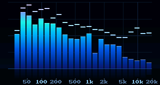
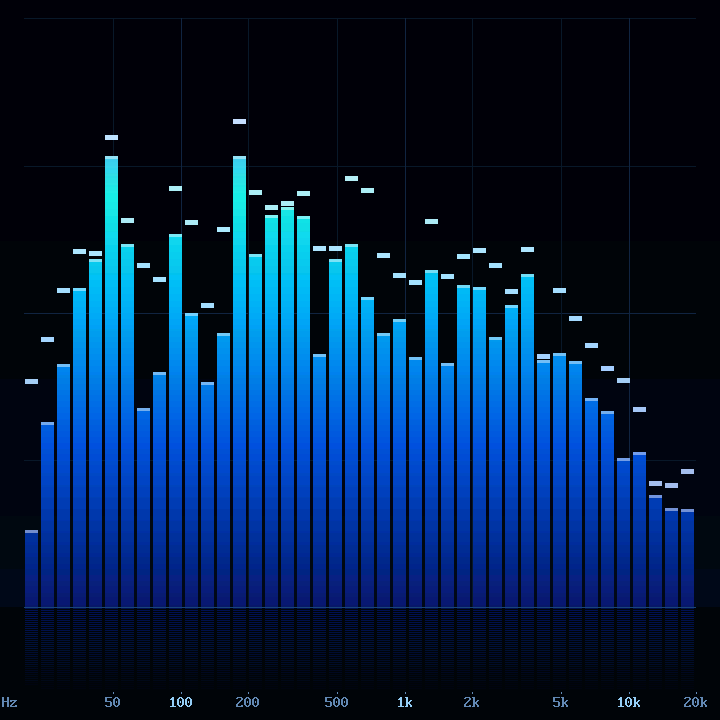

# spectrum

A spectrum analyzer that is built to look good rather than to measure
anything. It draws log-spaced bars from 20 Hz to 20 kHz in a cool gradient,
with peak caps that hang and then fall, a faint reflection under the baseline,
and frequency labels along the bottom. On a board running usbif's USB sound
card it shows the audio the PC is playing. The levels are computed in C, in
the sound card's pump. Everywhere else it plays fake music.



| 800x480, segmented | 320x170 (T-Embed) |
|:--:|:--:|
|  |  |

## Run it

From `lib/`:

```bash
micropython examples/spectrum/spectrum.py
SPECTRUM_STYLE=segmented micropython examples/spectrum/spectrum.py
PYDEVICES_WIDTH=320 PYDEVICES_HEIGHT=170 PYDEVICES_SCALE=3 micropython examples/spectrum/spectrum.py
```

On desktop the window opens at 800x480. On a board, the example takes its size
from the panel. It prints the frame rate and the cost of each part of a frame
every five seconds.

## What's where

`spectrum_view.py` does the drawing and knows nothing about audio. Hand
`SpectrumView.update()` one level per band, from 0 to 1, and it handles the
ballistics itself: bars rise fast and fall at a steady rate, and the peak caps
hold for about half a second before dropping with gravity. The palette, band
count, timings and colours are constants at the top of the file.

`fake_music.py` is the stand-in source: a four-bar loop at 120 BPM with kick,
snare, hats, bass, a pad and a lead, plus a dead stop and a breakdown so you
can watch the fall-off. Its docstring has the arrangement. The loop is seeded,
so every run is the same.

`capture.py` renders headless under MicroPython and reports timings, and
`make_captures.py` (CPython with Pillow) turns those renders into the images
in `docs/screenshots/`.

## How it stays cheap

Every bar is a single `blit` from a gradient column that was built once, so a
tall bar costs the same as a short one. The segment gaps and the reflection's
scanlines use a colour key, so the grid shows through them. The static art
(background, grid, labels) is painted once into a second framebuffer. Each
frame copies back only the row strip the bars could have touched, and that
strip is all that goes to the panel.

On desktop MicroPython at 800x480 with 48 bands, a frame costs about 0.2 ms to
generate the data, 0.7–1.5 ms to draw and 0.9 ms to blit to the SDL window.
The timer caps it at 50 fps.

## On the ESP32-P4 panel, beside the sound card



This needs a firmware with usbif's meter ([usbif#50](https://github.com/PyDevices/usbif/pull/50)),
which adds `uac_pump_meter()` and `uac_pump_levels()`. Import `spectrum` before
running `soundcard.py`, and the meter draws from a timer while the sound card
runs. `pump_levels.py` is the real source.

What the measurements found (2026-09-25):

- **Drawing costs no USB packets, once one setting changes.** A cache
  writeback (`esp_cache_msync`) runs with interrupts off, and syncing the
  panel held the USB interrupt off long enough to drop delivery to
  98.7-99.4 %, under the 99.5 % gate. With the writeback sliced
  (`CONFIG_ESP_MM_CACHE_MSYNC_C2M_CHUNKED_OPS`), meter on and meter off match
  to within 0.03 %: 99.75-99.88 % against 99.77-99.86 %. The P4 panel's board
  definition carries that setting since micropython-pydevices#23.
- **The sound card's own baseline** settles near 99.8 % a window or two into a
  48 kHz stream, with or without the meter. A 24 kHz wire holds 100 %.
- **The cost in the pump** is 1.05 % of a 360 MHz core for the feed plus
  3.2-3.8 % for the analysis: two FFTs, 60 a second, with the longest single
  analysis about 1 ms.
- **The frame rate** is 50 fps in silence, 27-29 with every bar moving and 19
  with loud music. Each bar is two prebuilt columns, only the rows that moved
  are copied, and one band is presented a frame (`SpectrumView.render_columns`).
- **The low end, from a full-range track:** the 22, 26 and 30 Hz bars sit near
  empty. From 35 Hz up, every bar moves. The top four bars (10-20 kHz) also
  hover near the floor.

[`tools/spectrum/meter_gate.py`](../../../tools/spectrum/meter_gate.py) (board) and
[`tools/spectrum/play_src.py`](../../../tools/spectrum/play_src.py) (Windows Python)
reproduce the numbers.
